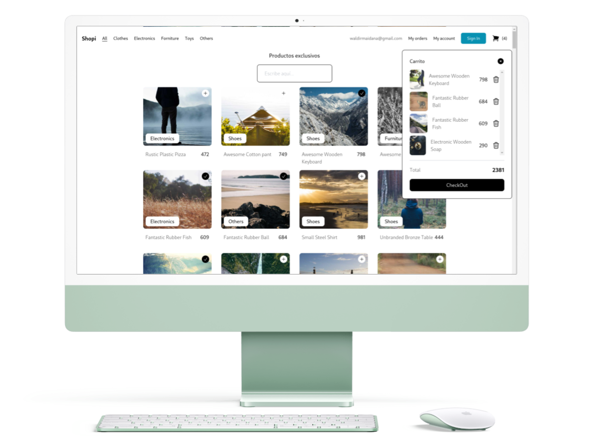

  

  

  
### Índice  
- [Descripción del proyecto](#Descripción-del-proyecto) 
- [Funcionalidades del proyecto](#Funcionalidades-del-proyecto)  
- [Acceso al proyecto](#Acceso-al-proyecto)  
- [Tecnologías utilizadas](#Tecnologías-utilizadas)  
- [Autores](#Autores)  
## Descripción del proyecto  
E-commerce Basico con carrito de compras
   
## Funcionalidades del proyecto 
- `Funcionalidad 1:` Conexión con la API "Platzi Fake Store"
- `Funcionalidad 2:` Agregar productos al carrito de compras
- `Funcionalidad 3:` Filtrado por categoria y busqueda de productos por titulo
## Acceso al proyecto
[Demo](https://aluraflix-phi-five.vercel.app/)
## Tecnologías utilizadas
- React
- Vite
- Tailwind CSS
## Autores
| [ Waldir Maidana ](https://github.com/zidjian) |
| :---: |